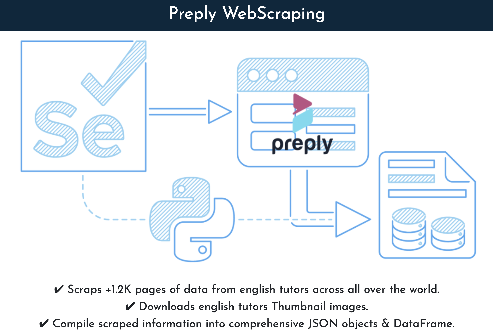

# **Preply Web Scrape and Upload to Firebase**

### Task Description

Python script that scrapes records from a website (each record has about ten text fields and two images which need to be downloaded to a local folder) and save all the text information to a pandas data frame along with the image file names. 
Each record on the website has a unique id in the url string which can be used as the index/primary key. I think using Selenium with ChromeDriver will be the easiest way to do this because 
I will have to login through the browser window and navigate to the main page and pick some options before starting the scraping loop.
The second part of the project will be to push the scraped information and images to my firebase project. Since each record has a unique identifier it should be pretty straight forward to use that as the primary key to save the text to firestore. Also the images will need to be uploaded to firebase storage and links to the images saved as a field in firestore for each record.

### References
- https://towardsdatascience.com/how-to-download-an-image-using-python-38a75cfa21c
- https://pypi.org/project/Pyrebase/
- https://github.com/thisbejim/Pyrebase
- https://www.youtube.com/watch?v=f_3YFEEovCc&t=622s